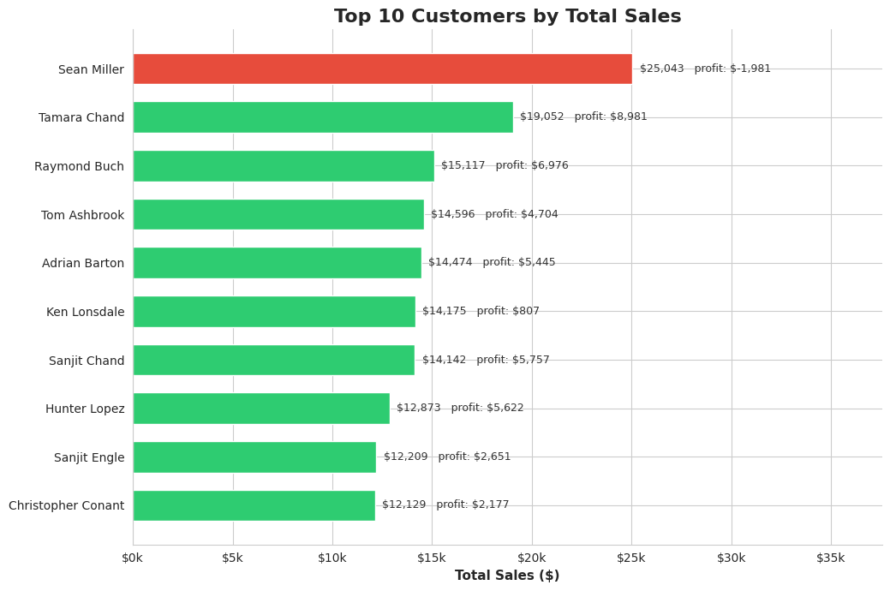
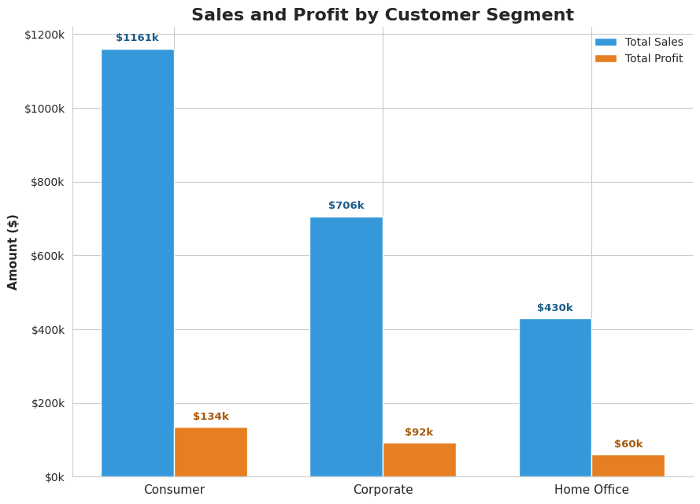

# Week 01: Superstore Customer Analysis

Who are this business's best customers, and is its biggest spender actually its best customer?

A retail superstore has hundreds of customers, but is every customer equally valuable? And is the customer who spends the most actually the customer who makes the most money?

This project answers those questions using Python and Pandas, turning the Customer Name and Segment columns into real business insights.

## Dataset

[Superstore Dataset](https://www.kaggle.com/datasets/vivek468/superstore-dataset-final) (Kaggle), the same dataset used in Week 2 and Week 3's analyses.

## Tools

* Python
* Pandas
* Matplotlib
* Seaborn

## Key Findings

### 1. The Biggest Spender Is Not the Most Valuable Customer

Sean Miller is the top customer by total sales ($25,043), but he is the only customer in the top 10 who is actually unprofitable, losing the business $1,981.

### 2. Frequent Customers Are a Different Group Entirely

The customers who order most often are not the same people who spend the most. Several frequent repeat customers are also unprofitable, a bigger long-term risk than a single large unprofitable order.

### 3. Segment Performance Is Not What Total Sales Suggests

Consumer brings in the most total sales, but its profit is proportionally small compared to its size. Home Office earns far less in sales but converts a larger share of it into profit.

## Visualizations

### Top 10 Customers by Total Sales

The top-spending customer, Sean Miller, is actually the only unprofitable customer in the top 10, standing out clearly in red against the rest.



### Sales and Profit by Customer Segment

Consumer brings in the most total sales, but its profit is proportionally small compared to its size, while Home Office earns far less in sales yet converts a larger share of it into profit.



## Business Recommendations

1. Do not equate high spending with a good customer. Sean Miller should be reviewed individually, what was actually purchased and at what discount, before treating him as a top customer.

2. Investigate the frequent but unprofitable repeat customers. Losing money on customers who order often is a bigger long-term risk than one large unprofitable order.

3. Shift marketing focus toward Home Office. It has the smallest sales volume but the best profit margin of the three segments.

## Conclusion

This analysis shows that high sales do not always lead to high profit. Sean Miller has the highest sales, but the business is actually losing money on him. Meanwhile, some mid-tier customers are more valuable because they generate better profits.

Consumer brings in the most revenue but the weakest margin, while Home Office is smaller but leaner. Measuring customer value by profit, not just revenue, avoids rewarding the wrong people.

## Folder Structure

```text
week01-superstore-customer/
│
├── README.md
├── data/
│   └── raw/
│       └── Superstore.csv
├── notebooks/
│   └── analysis.ipynb
└── reports/
    └── figures/
        ├── top10_customers_by_sales.png
        └── sales_profit_by_segment.png
```

Shared `LICENSE` and `requirements.txt` for the whole series live at the repository root, not inside this folder.

## How to Run

### 1. Clone the Repository

```bash
git clone https://github.com/Coding-With-Subin/weekly-data-science-challenges.git
cd weekly-data-science-challenges
```

### 2. Install Dependencies

From the repository root:

```bash
pip install -r requirements.txt
```

### 3. Dataset

Download the [Superstore Dataset](https://www.kaggle.com/datasets/vivek468/superstore-dataset-final) from Kaggle.

Place the CSV file in:

```text
week01-superstore-customer/data/raw/Superstore.csv
```

### 4. Run the Analysis

Open the notebook:

```text
week01-superstore-customer/notebooks/analysis.ipynb
```

Run the notebook cells to reproduce the analysis and visualizations.

## License

This project is licensed under the MIT License. See the root [LICENSE](../LICENSE) file for details.

The MIT License applies to the code and project materials in this repository. The Superstore dataset is sourced from Kaggle and remains subject to its original licensing and usage terms.

## Key Takeaway

**The customer who spends the most is not always the customer who's worth the most.**

This project demonstrates how measuring customer value by profit, not just revenue, changes who actually looks like your best customer.

*Part of the Weekly Data Science Challenges series.*