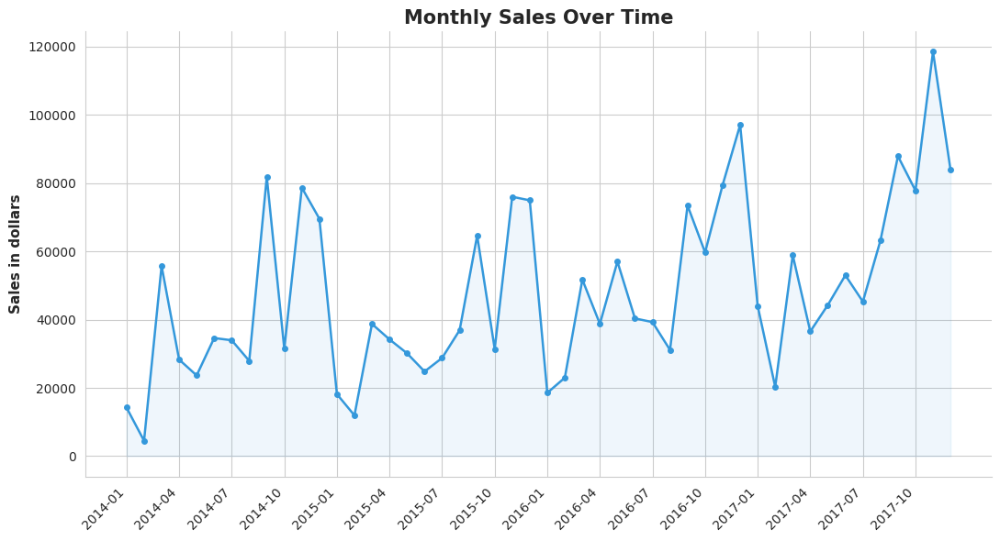
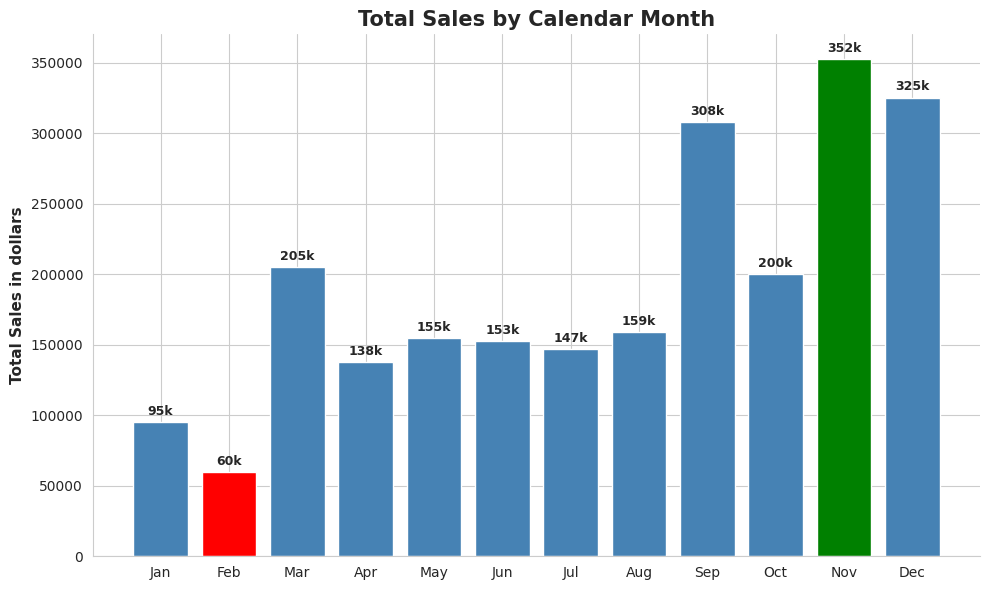

# Week 02: Superstore Sales Trends Analysis

When does this business actually make its money, and when does it go quiet?

A retail superstore has years of sales data, but does it know when it actually sells the most? Is the business growing over time, or staying flat? And is there a month that looks like a problem at first glance but is actually just a normal, repeating pattern?

This project answers those questions using Python and Pandas, turning the Order Date column into real business insights.

## Dataset

[Superstore Dataset](https://www.kaggle.com/datasets/vivek468/superstore-dataset-final) (Kaggle), the same dataset used in Week 3's profitability analysis.

## Tools

* Python
* Pandas
* Matplotlib
* Seaborn

## Key Findings

### 1. The Business Is Growing

Sales dipped slightly in 2015 (-2.8%) but grew strongly in 2016 (+29.5%) and 2017 (+20.4%).

### 2. Clear Seasonality Every Year

November is the strongest month every year, while January and February are consistently the weakest. This pattern repeats across all four years in the dataset.

### 3. The Mystery: A Drop That Looks Bad But Isn't

Every January looks like a sharp decline compared to December. Checking the pattern year by year shows this happens every year. It's a normal seasonal dip, not a business problem.

## Visualizations

### Monthly Sales Over Time

Sales rise and fall in a repeating pattern every year, with a clear overall upward trend from 2014 to 2017.



### Total Sales by Calendar Month

November is the strongest month across all years, while February is consistently the weakest.



## Business Recommendations

1. Stock up and push marketing hardest from September through December. This period brings in the most sales every year.

2. Do not worry about the drop in January and February. It happens every year and is a normal pattern, not a business problem.

3. Look into what changed in 2016. Sales growth jumped that year compared to the year before, and understanding why could help repeat it.

## Conclusion

Sales follow a clear pattern every year, rising toward the end of the year and dropping in January and February. The business is also growing overall, with strong growth in 2016 and 2017.

A slow month is not always a problem. Understanding the seasonal pattern helps plan inventory, staffing, and marketing ahead of time instead of reacting to a normal dip.

## Folder Structure

```text
week02-superstore-sales-trends/
│
├── README.md
├── data/
│   └── raw/
│       └── Superstore.csv
├── notebooks/
│   └── analysis.ipynb
└── reports/
    └── figures/
        ├── monthly_sales_trend.png
        └── seasonality_by_month.png
```

Shared `LICENSE` and `requirements.txt` for the whole series live at the repository root, not inside this folder.

## How to Run

### 1. Clone the Repository

```bash
git clone https://github.com/Coding-With-Subin/weekly-data-science-challenges.git
cd weekly-data-science-challenges
```

### 2. Install Dependencies

From the repository root:

```bash
pip install -r requirements.txt
```

### 3. Dataset

Download the [Superstore Dataset](https://www.kaggle.com/datasets/vivek468/superstore-dataset-final) from Kaggle.

Place the CSV file in:

```text
week02-superstore-sales-trends/data/raw/Superstore.csv
```

### 4. Run the Analysis

Open the notebook:

```text
week02-superstore-sales-trends/notebooks/analysis.ipynb
```

Run the notebook cells to reproduce the analysis and visualizations.

## License

This project is licensed under the MIT License. See the root [LICENSE](../LICENSE) file for details.

The MIT License applies to the code and project materials in this repository. The Superstore dataset is sourced from Kaggle and remains subject to its original licensing and usage terms.

## Key Takeaway

**A dip isn't always a problem. Knowing the pattern is what turns a scary chart into a plan.**

This project demonstrates how time-based analysis can turn a date column into a real business planning tool.

*Part of the Weekly Data Science Challenges series.*