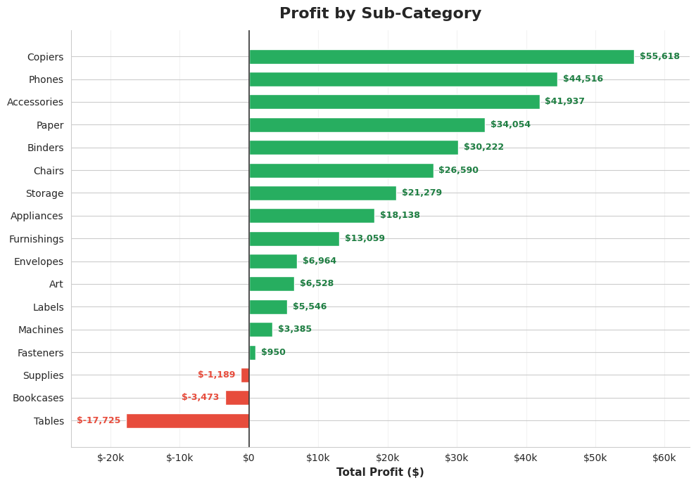
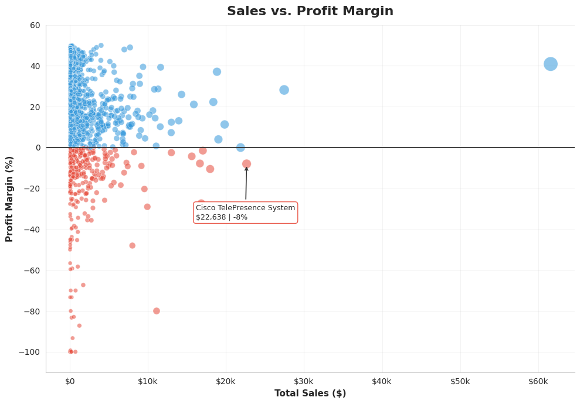

# Week 03: Superstore Profitability Analysis

Can you find the most profitable products and spot the ones that only *look* successful?

A retail superstore has years of sales data, but sales alone do not tell the full story. Some products generate high revenue while producing little or even negative profit.

This project analyzes the Superstore dataset using Python and Pandas to identify profitable and loss making products, sub categories, and regions. It also examines the relationship between sales, profit, profit margin, and discounting to uncover products that may appear successful but are actually hurting profitability.

## Dataset

[Superstore Dataset](https://www.kaggle.com/datasets/vivek468/superstore-dataset-final) from Kaggle.

The dataset contains approximately 10,000 order records from a US retail superstore, including:

* Sales
* Profit
* Discount
* Region
* Category
* Sub Category
* Product

## Tools

* Python
* Pandas
* Matplotlib
* Seaborn

## Key Findings

### 1. Most Profitable Categories

Technology and Office Supplies generate the majority of the overall profit.

Furniture appears relatively healthy at the category level, but its profitability is concentrated in Chairs and Furnishings.

### 2. A Hidden Loss Inside a Healthy Category

Tables, Bookcases, and Supplies are the only sub categories with negative total profit.

The Tables sub category is the biggest problem area, accounting for approximately $17,725 in losses.

### 3. Best Performing Region

The West region leads in:

* Sales
* Total profit
* Profit margin

The Central region has the second highest sales but the weakest profit margin, indicating that its revenue is being generated less efficiently.

### 4. High Sales Do Not Always Mean High Profit

Some products generate strong sales but still produce negative profit.

The analysis shows that profitability tends to decline as average discount increases, with profit often becoming negative around the 20% discount level.

This highlights an important business insight:

> High sales volume can hide poor profitability.

## Visualizations

### Profit by Sub Category

Tables, Bookcases, and Supplies are the only sub categories with negative total profit, while the remaining sub categories are profitable.



### Sales vs Profit Margin

Higher sales do not always result in higher profit margins. Several high selling products have negative margins, suggesting that heavy discounting can significantly reduce profitability.



## Business Recommendations

### 1. Control Discounting on Tables

Heavy discounting can quickly erode an already weak margin. Discount strategies for Tables should be reviewed and controlled.

### 2. Reprice or Reconsider the Tables Sub Category

Tables generate a significant overall loss of approximately $17,725. Pricing, discounts, costs, and product level performance should be investigated.

### 3. Improve Central Region Profitability

The Central region generates substantial sales but has a comparatively weak margin. Management should investigate the factors behind this difference and identify strategies from the stronger performing West region that could be applied where appropriate.

### 4. Evaluate Products Using Profit, Not Sales Alone

Products should not be judged only by sales volume. Profit and profit margin should also be considered when making pricing, promotion, and inventory decisions.

## Conclusion

High sales do not always mean high profit.

The analysis reveals that Tables is a major loss making sub category, while the West region is the strongest overall performer. It also shows how heavy discounting can turn high selling products into unprofitable ones.

For better business decisions, sales performance should be evaluated together with profit, profit margin, and discount levels rather than relying on revenue alone.

## Folder Structure

```text
week03-superstore-profitability/
│
├── README.md
├── data/
│   └── raw/
│       └── Superstore.csv
├── notebooks/
│   └── analysis.ipynb
└── reports/
    └── figures/
        ├── profit_by_subcategory.png
        └── sales_vs_profit_margin.png
```

Shared `LICENSE` and `requirements.txt` for the whole series live at the repository root, not inside this folder.

## How to Run

### 1. Clone the Repository

```bash
git clone https://github.com/Coding-With-Subin/weekly-data-science-challenges.git
cd weekly-data-science-challenges
```

### 2. Install Dependencies

From the repository root:

```bash
pip install -r requirements.txt
```

### 3. Dataset

Download the [Superstore Dataset](https://www.kaggle.com/datasets/vivek468/superstore-dataset-final) from Kaggle.

Place the CSV file in:

```text
week03-superstore-profitability/data/raw/Superstore.csv
```

### 4. Run the Analysis

Open the notebook:

```text
week03-superstore-profitability/notebooks/analysis.ipynb
```

Run the notebook cells to reproduce the analysis and visualizations.

## License

This project is licensed under the MIT License. See the root [LICENSE](../LICENSE) file for details.

The MIT License applies to the code and project materials in this repository. The Superstore dataset is sourced from Kaggle and remains subject to its original licensing and usage terms.

## Key Takeaway

**Revenue tells you what sells. Profit tells you what works.**

This project demonstrates how exploratory data analysis can transform raw retail transactions into practical business insights and recommendations.

*Part of the Weekly Data Science Challenges series.*