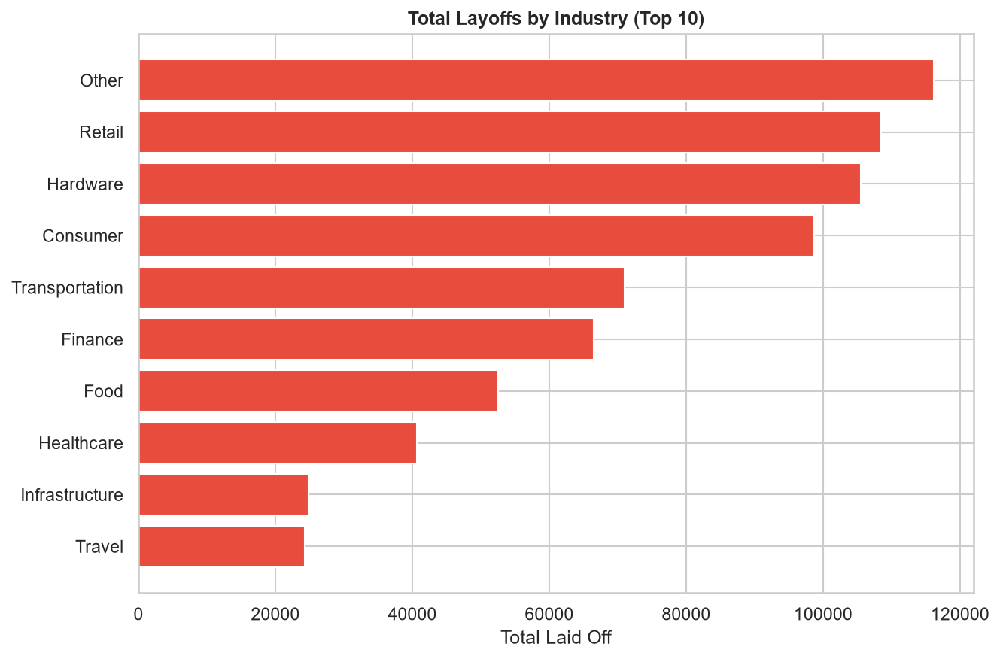
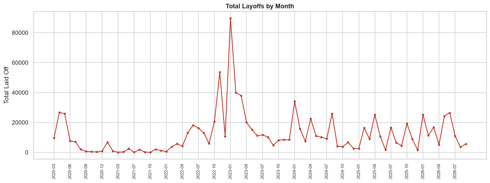

# Week 05: Tech Layoffs Analysis

Are early industries quietly absorbing the most layoffs?

Tech companies have been cutting jobs steadily since 2020, but the raw data isn't trustworthy on its own. Duplicate rows, inconsistent country names, and missing layoff figures can distort which industries and months actually got hit hardest.

This project cleans and analyzes the Layoffs dataset using Python and Pandas to find where job losses are concentrated, identify the worst month on record, and show why percentage laid off and total laid off can tell very different stories about the same event.

## Dataset

[Layoffs Dataset](https://www.kaggle.com/datasets/swaptr/layoffs-2022) from Kaggle.

The dataset tracks tech layoffs from March 2020 through recent updates, including:

* Company, industry, and country
* Total employees laid off
* Percentage of workforce laid off
* Layoff date
* Funding stage and funds raised

## Tools

* Python
* Pandas
* Matplotlib
* Seaborn

## Key Findings

### 1. Layoffs Are Concentrated in a Few Industries

"Other," Retail, and Hardware absorbed the largest total losses, at 116,165, 108,495, and 105,480 employees respectively, well ahead of the remaining industries in the dataset.

### 2. January 2023 Was the Single Worst Month on Record

Total monthly layoffs peaked at 89,709 in January 2023, more than double the next-highest month. The data also shows a second, smaller wave building through 2024-2026.

### 3. Percentage Laid Off and Total Laid Off Tell Opposite Stories

Small companies can post a 100% layoff rate while affecting only a handful of people. Meanwhile, a 1-10% cut at a company like Amazon, Google, or Microsoft still means 8,000 to 14,000 real job losses.

This highlights an important business insight:

> The company that "lost more of its workforce" isn't always the company that laid off more people.

## Visualizations

### Total Layoffs by Industry

"Other," Retail, and Hardware account for the largest total layoffs across the dataset.



### Total Layoffs by Month

January 2023 stands out sharply as the worst single month, with a second wave visible later in the dataset.



## Business Recommendations

### 1. Don't Rank Severity by Percentage Alone

A 100% layoff at a 6-person startup and a 1% layoff at Amazon are not comparable events. Total headcount affected is usually the more meaningful number for real-world impact.

### 2. Watch Retail and Hardware Closely

These industries rank in the top 3 for total layoffs despite not always dominating headlines the way "tech" broadly does.

### 3. Treat January 2023 as the Benchmark for a Severe Month

At roughly 89,700 layoffs, it's more than double the next-highest month, useful as a reference point for flagging future spikes early.

## Conclusion

Layoffs are not evenly spread across the tech industry. "Other," Retail, and Hardware absorbed the largest total losses, and January 2023 stands out sharply as the single worst month in the dataset. Percentage laid off and total laid off tell opposite stories at the extremes: small companies can post a 100% layoff rate while affecting only a handful of people, while a 1% cut at Amazon or Google still means thousands of real job losses.

For better decisions, total headcount impact should be weighed alongside percentage, not in place of it, when judging real-world severity.

## Folder Structure

```text
week05-tech-layoffs/
│
├── README.md
├── data/
│   └── layoffs.csv
├── notebooks/
│   └── analysis.ipynb
└── reports/
    └── figures/
        ├── chart1_layoffs_by_industry.png
        └── chart2_layoffs_by_month.png
```

Shared `LICENSE` and `requirements.txt` for the whole series live at the repository root, not inside this folder.

## How to Run

### 1. Clone the Repository

```bash
git clone https://github.com/Coding-With-Subin/weekly-data-science-challenges.git
cd weekly-data-science-challenges
```

### 2. Install Dependencies

From the repository root:

```bash
pip install -r requirements.txt
```

### 3. Dataset

Download the [Layoffs Dataset](https://www.kaggle.com/datasets/swaptr/layoffs-2022) from Kaggle.

Place the CSV file in:

```text
week05-tech-layoffs/data/layoffs.csv
```

### 4. Run the Analysis

Open the notebook:

```text
week05-tech-layoffs/notebooks/analysis.ipynb
```

Run the notebook cells to reproduce the analysis and visualizations.

## License

This project is licensed under the MIT License. See the root [LICENSE](../LICENSE) file for details.

The MIT License applies to the code and project materials in this repository. The Layoffs dataset is sourced from Kaggle and remains subject to its original licensing and usage terms.

## Key Takeaway

**Percentage tells you how much of a company left. Total headcount tells you how many people were actually affected.**

This project demonstrates how data cleaning and exploratory analysis can turn a messy, real-world dataset into a trustworthy business narrative.

*Part of the Weekly Data Science Challenges series.*