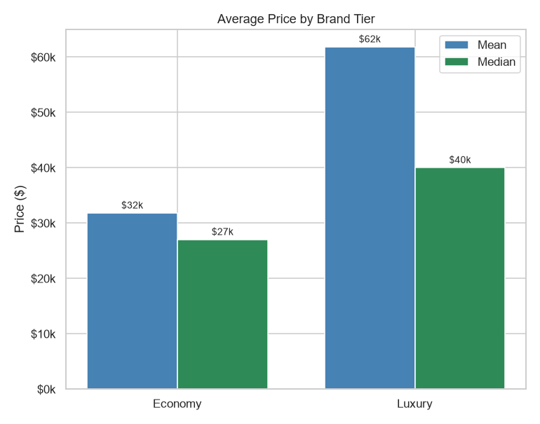
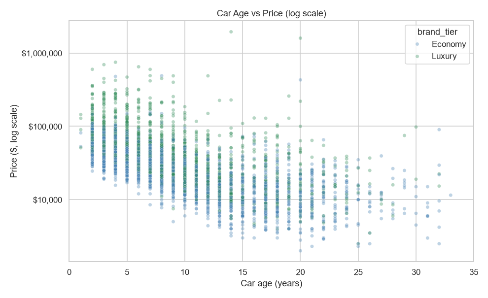
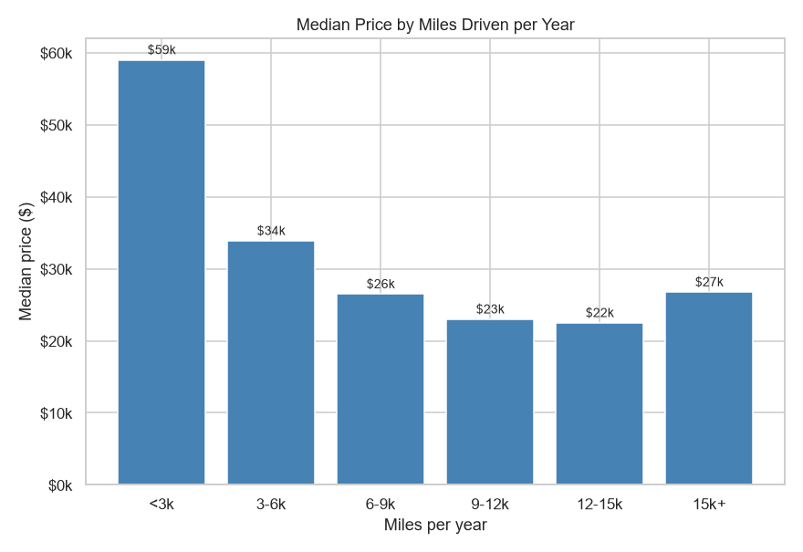

# Week 06: What Actually Drives a Used Car's Price?

**Short answer: age drives the price, brand sets the level, and clean data makes the difference.**

Which matters most for a used car's price: age, brand tier, or miles driven per year?

The raw used car data cannot be trusted on its own. Prices and mileage are stored as text, brand names are split across columns, and blank values hide real information. This project cleans 4,009 listings using Python and Pandas, builds new features on top of the cleaned data, and tests which factor explains price best.

## Dataset

[Used Car Price Prediction Dataset](https://www.kaggle.com/datasets/taeefnajib/used-car-price-prediction-dataset) from Kaggle.

The dataset contains 4,009 used car listings, including:

* Brand, model, and model year
* Mileage
* Fuel type and engine
* Accident history and clean title status
* Transmission and colors
* Listing price

## Tools

* Python
* Pandas
* NumPy
* Matplotlib
* Seaborn

## Data Cleaning

The raw data hid several problems that would have distorted the results:

* **Text numbers:** `price` and `milage` were stored as text with `$`, commas, and `mi.` symbols.
* **Broken brand names:** Land Rover, Aston Martin, and Alfa Romeo were split across the brand and model columns (158 rows).
* **Missing fuel type was not random:** all 87 Teslas were blank and their engine said Electric Motor, so 149 cars were recovered as Electric.
* **Blank clean title does not mean "No":** those cars are newer and far less likely to have an accident (7% vs 28%), so they were labelled Not listed.
* **One impossible price:** a 2005 Maserati listed at $2,954,083 was excluded as an entry error.

## Key Findings

### 1. Vehicle Age Is the Strongest Pricing Factor

Median price falls from about $57,000 for cars up to 3 years old to about $12,000 for cars 16 or more years old. Car age has a correlation of -0.70 with price, compared with -0.40 for mileage per year.

### 2. Brand Tier Shapes the Price Level

The luxury median is $39,998 against $27,000 for economy, about 1.5x, and the premium stays between 1.4x and 1.6x at every age band. The mean gap looks larger (1.9x) because a few supercars pull the luxury average up.

### 3. Price Drops Fastest at Low Mileage per Year

Price falls hardest from under 3,000 to 3,000 to 6,000 miles per year, then flattens past about 9,000. The highest mileage group rises again because work trucks and vans hold their value for a different reason.

This highlights an important business insight:

> An engineered feature is only as trustworthy as the cleaning underneath it.

## Bonus Mystery Question

The unrealistic mileage per year values turned out to be real outliers: work vans and trucks at the high end, and near new cars at the low end. The only true error was the $2.95M Maserati price, which a mileage check alone would have missed.

## Visualizations

### Average Price by Brand Tier

Luxury cars cost more than economy cars, and the mean and median gaps differ because of a few supercars.



### Car Age vs Price

Price falls steadily as cars get older, and luxury stays above economy at every age. One 1974 car is cropped so the rest of the chart stays readable.



### Median Price by Miles Driven per Year

The steepest drop happens at low mileage, and the curve flattens after about 9,000 miles per year.



## Business Recommendations

### 1. Price Around Vehicle Age

Model year should be the starting point, with mileage and vehicle tier used to refine the price.

### 2. Use 9,000 Miles per Year as a Threshold

Low use cars can command a premium, while price reductions should flatten beyond roughly 9,000 miles per year.

### 3. Balance Luxury and Economy Inventory

Luxury cars offer higher value per vehicle, while economy cars provide greater listing volume.

### 4. Add a Price Validation Check

Brand level median checks can catch extreme entries, such as the $2.95M Maserati, before they distort the analysis.

## Conclusion

Vehicle age is the strongest pricing factor, while brand tier consistently shapes the price level. Cleaning and validating the data were equally important, ensuring reliable comparisons and preventing missing values and extreme outliers from distorting the results.

## Folder Structure

```text
week06-used-cars/
│
├── README.md
├── data/
│   └── raw/
│       └── used_cars.csv
├── notebooks/
│   └── analysis.ipynb
└── reports/
    └── figures/
        ├── age_vs_price.png
        ├── price_by_brand_tier.png
        └── price_by_mileage_per_year.png
```

Shared LICENSE and requirements.txt for the whole series live at the repository root, not inside this folder.

## How to Run

### 1. Clone the Repository

```bash
git clone https://github.com/Coding-With-Subin/weekly-data-science-challenges.git
cd weekly-data-science-challenges
```

### 2. Install Dependencies

From the repository root:

```bash
pip install -r requirements.txt
```

### 3. Dataset

Download the [Used Car Price Prediction Dataset](https://www.kaggle.com/datasets/taeefnajib/used-car-price-prediction-dataset) from Kaggle.

Place the CSV file in:

```text
week06-used-cars/data/raw/used_cars.csv
```

### 4. Run the Analysis

Open the notebook:

```text
week06-used-cars/notebooks/analysis.ipynb
```

Run the notebook cells from top to bottom to reproduce the analysis and visualizations.

## License

This project is licensed under the MIT License. See the root [LICENSE](../LICENSE) file for details.

The MIT License applies to the code and project materials in this repository. The Used Car Price dataset is sourced from Kaggle and remains subject to its original licensing and usage terms.

## Key Takeaway

*Age tells you the price level. Brand tells you the premium. Clean data tells you whether you can trust either.*

This project demonstrates how data cleaning and exploratory analysis can turn a messy, real world dataset into a trustworthy business narrative.

Part of the Weekly Data Science Challenges series.
